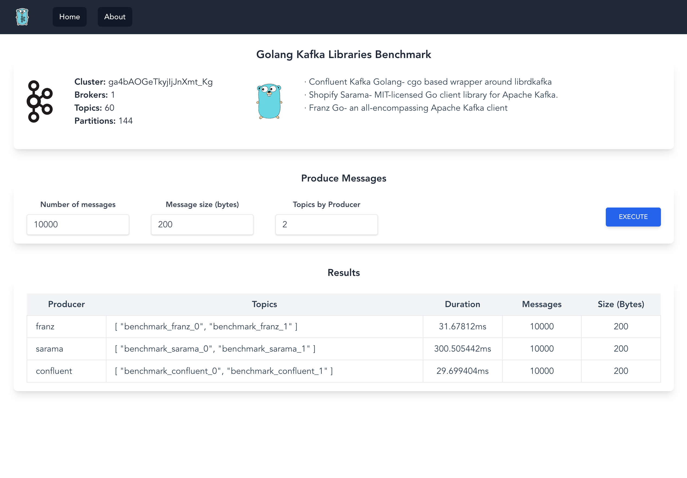

# Golang Kafka Playground 

Project to play with Kafka and Golang.

Libraries used:

* Confluent Kafka Golang 
* Sarama Golang
* Franz Golang

Web App made with Vue 3 (Vite)

Compose: 

- Zookeeper
- Kafka Broker
- Confluent Control Center
- Go Application
- Prometheus 
- Grafana

## Build 
```sh
docker-compose build  
```

## Up

```sh
docker-compose up -d
```

## Api 

```sh
 curl -X POST http://localhost:9000/api/produce \
 -H 'Content-Type: application/json' \
 -d '{"messages":200000, "size": 800}'
```

## Web

```sh
http://localhost:9000
```
 

 
